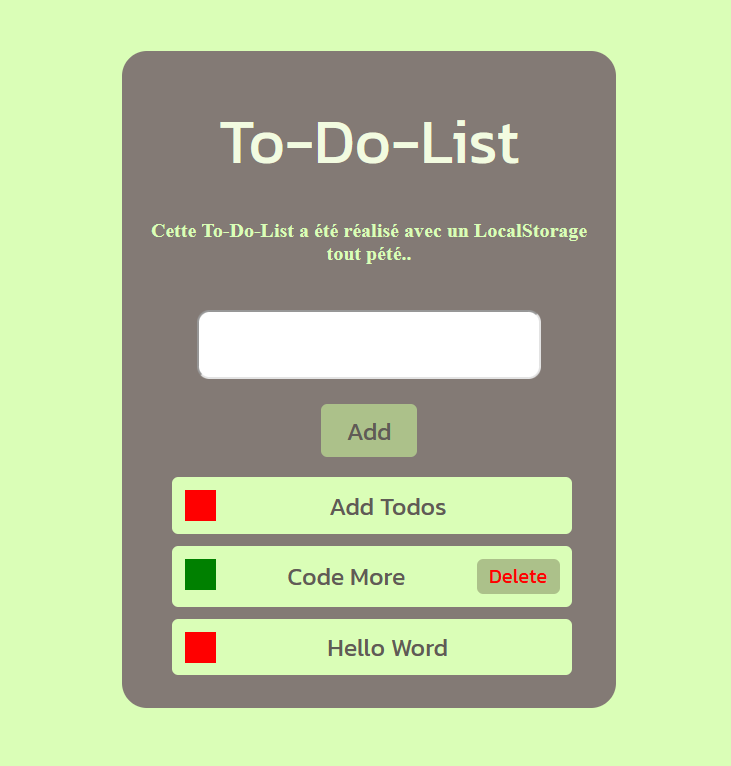

# The To-do-list

Create a to-do list with these requirements:

## Functional Requirements

- An input field for adding new tasks to the list.
- A button for submitting the new task.
- A list of all the tasks that have been added.
- A checkbox next to each task that allows the user to mark the task as completed.
- A button for deleting completed tasks.
## UI Requirements

- The application should have a simple and clean design.
- The input field and the submit button should be easily visible and accessible.
- The list of tasks should be clearly displayed and easy to read.
- The checkbox and delete buttons should be clearly visible and easily clickable.

## Screenshot

